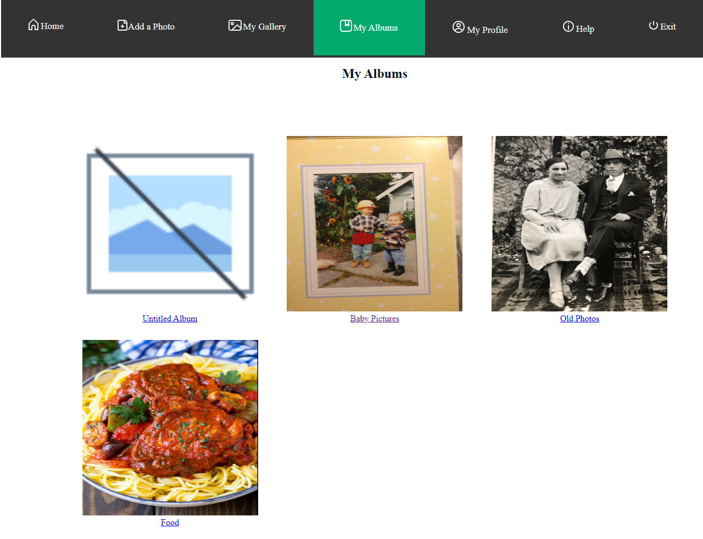
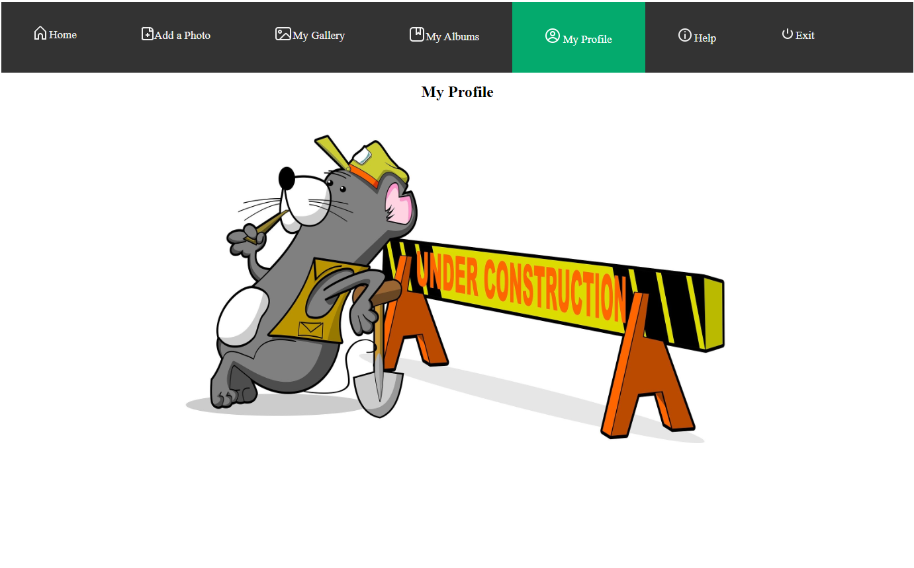
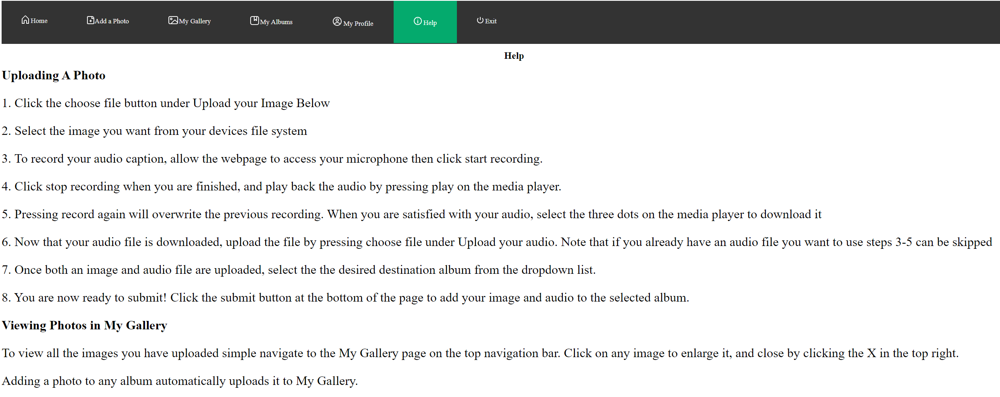

# Winter23_ClassProject_PHOTO_ALBUM_NARRATION

This project is web based. No installation is required. 
The idea behind having this project on a website is that it provides ease of access for people to use instead of downloading an app. 
It is also easier for people to share their album link for other people to watch them. 
We are going for a simple design for this website so that it will be easier for everyone with any skill or knowledge about technology.
The design includes large text, high contrast colors, and as little buttons as possible. 
We want to create a website for people of any age, any skill level, just to be able to upload their photos digitally and help them tell their story to their friends or family. 
Since the covid days, most people are unable to meet their friends or family, so this is a website to help them tell a story about them or a picture they chosen. 
This is still a work in progress. 

Design guidelines:
        - Design is crafted from older adult's feedback 
        - Headers were created with sufficent size and contrast 
        - Simple UI for easier navigation 
        - contrast tested using WAVE tool 
        - suitable font for better reading 
        - brief and easy to understand instruction 
        - buttons sufficiently spaced 
        - minimal pages design for better viewing 

Team members: 

    David Lee
        -created the welcome page
        -css stylings
        -find reference sources
        -documenting
        -tested website functions

    Charlie Koeing
        -developed the add photo page
        -coded backend js
        -created navigation stylings
        -added icons and images

# Documentation and explanation of functionalities:

    
        -This is the welcome page, it is design to be simple so that it won't overwhelm the user  
        -click on the green "GET STARTED" to enter the site
    
   

        -This is the main page, the top navigation bar includes text and icons for easier recognition  
        -**"Add a Photo"** redirect user to the album creation page where user can upload image and record audio narration 
        -**"My Gallery"** Shows all the photo that has been uploaded  
        -**"My Albums"** Shows collection of photos in a group 
        -**"My Profile"** shows the user profile information 
        -**"Help"** shows detailed instruction
        -**"Exit"** return to welcome page

   

        -This is the add photo page, user can upload their image and record their narration or upload a local save narration

   

        -This is an example of what an uploaded image looks like and the voice bar below is the recorded narration 
        -click the record audio to begin record. For first time users, you need to allow browser to access to your microphone 
        -you can click record again, and it will replace your previous recording. 
        -image and recoding will not be saved until it is submitted, user can redo as much as they can 
        -**NOTE:** to download a copy of the audio narration, you need to play the audio and the download option will appear 
        -the 3 dot menu will show the audio download and the playback speed

   

        -The gallery page shows all the photos that have been uploaded

   

        -The album page shows the grouped photos with their corresponding narration

   

        -This page shows the profile information of the user (Still a work in progress)

   

        -The help page shows detailed instruction on how to use the website

