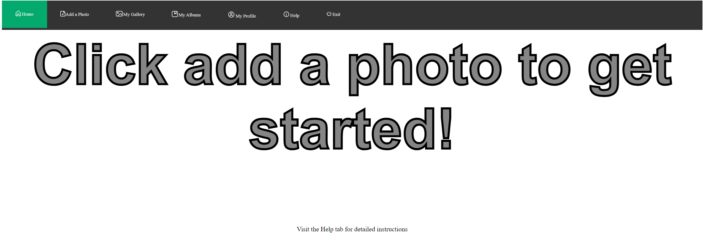
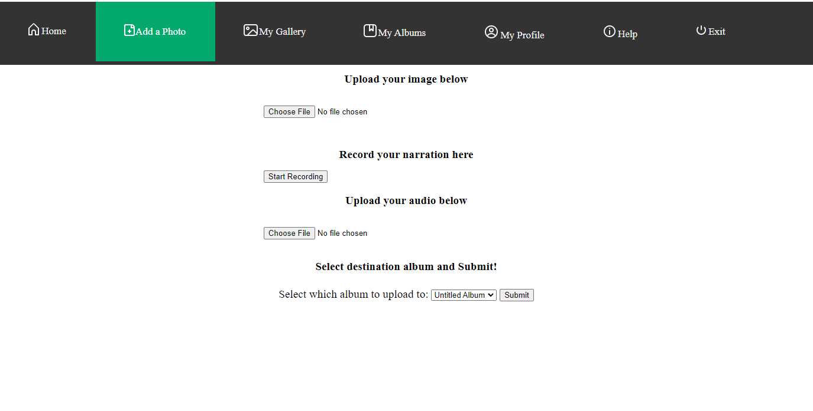
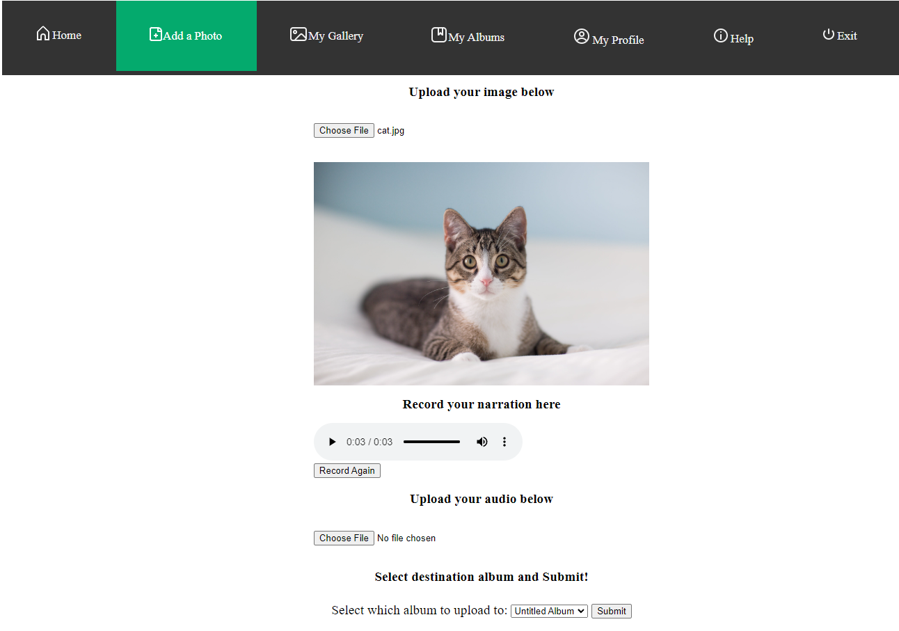
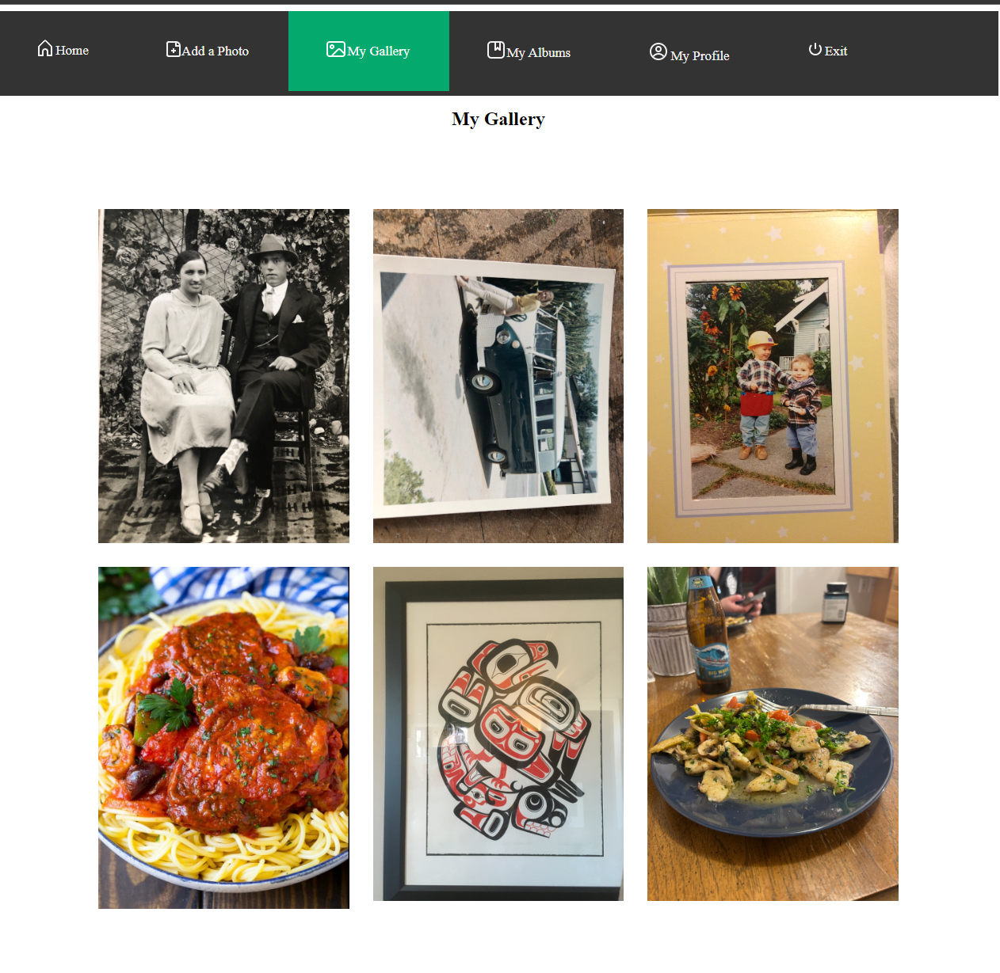

# Winter23_ClassProject_PHOTO_ALBUM_NARRATION

Team members: 

    David Lee
        -created the welcome page
        -css stylings
        -find reference sources
        -documenting
        -tested website functions

    Charlie Koeing
        -developed the add photo page
        -coded backend js
        -created navigation stylings
        -added icons and images

This project is web based. The idea behind having this project on a website is that it provides ease of access for people to use instead of downloading an app. It is also easier for people to share their album link for other people to watch them.
We are going for a simple design for this website so that it will be easier for everyone with any skill or knowledge about technology.
This is still a work in progress.

Documentation and explanation of functionalities:
    
        -This is the welcome page, it is design to be simple so that it won't overwhelm the user  
        -click on the green "GET STARTED" to enter the site
    
   

        -This is the main page, the top navigation bar includes text and icons for easier recognition  
        -**"Add a Photo"** redirect user to the album creation page where user can upload image and record audio narration 
        -**"My Gallery"** Shows all the photo that has been uploaded  
        -**"My Albums"** (Work In progress) 
        -**"My Profile"** (Work In progress)

   

        -This is the add photo page, user can upload their image and record their narration or upload a local save narration

   

        -This is an example of what an uploaded image looks like and the voice bar below is the recorded narration

   

        -The gallery page shows all the photos that have been uploaded
